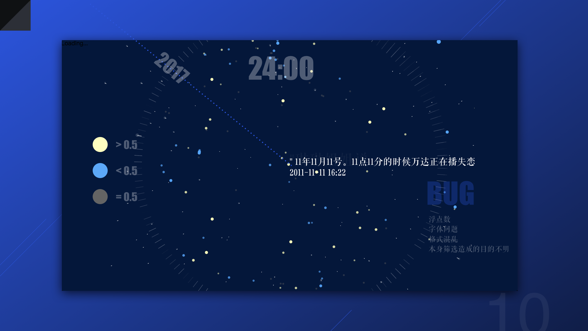

# Moody
👉[Click Me to Visit](https://aliceleon.github.io/moody-data)

### Idea

My initial intention was to visualise a relationship and how would people show their emotional condition while in it through analysing their social media.

We also wanted to emphasise the relationship between on person an another is of great importance and should be taken seriously.

Meanwhile, we hope to get go visual effects and make it as complete and extensible as possible.

We use Weibo in this case since it's a platform where most people are likely to share their account with strangers and really close friends. People gather there mostly out of pure interests, at least for me and other people in my class.

### Process
**Tool**: P5.js. We think it's more flexible and highly scalable.

**Step1**: We use python crawls to get one's weibo data, including username, time, comments, likes.

**Step2**: Chose the original and meaningful ones that actually express their feelings. Sentiment analysis.

**Step3**: Transform data and the result of sentiment analysis into readable numbers. e.g. from 0-1.

Using JSON format for next steps.

The API that tells the emotion value from a sentence is from here [DIYgod's Text2Emotion](https://github.com/DIYgod/Text2Emotion)

### Notes on how to read this :

- Imagine this picture as a 24 hours' clock. The location of the dots represents when a person sends the weibo.
- The distance from each dot to the centre of the image represents the date of the weibo. In this case, the first weibo was posted in 2011, and the last one was posted in 2017.
- The emotional conditions are marked from 0 to 1 where the most positive mood is 1 and the most negative is 1
- The yellow dots represent positive motions (over 0.5). The dots get bigger and the colour gets more solid as the number gets closer to 1.
- The blue dots represent negative motions (below 0.5). The dots get bigger and the colour gets more solid as the number gets closer to 0.
- The grey ones represent motions values as 0.5.
- The content of each weibo shows up on hover. There's an unsolved problem on formats and fonts.
- Thumbnails are on the left.

### Unsolved questions:

1. Mass data takes a lot of time to process
2. It's hard to tell which part is meaningful while others are not.
3. The whole process is very unlikely to be fully automatic. It still requires many artificial works.

### Summary

1. The project visualised users' weibo data and provides a good way to see directly and clearly how their mood varies.
2. The API we use take quite some time to process and it's hard to make a real-time display. In this case, we have already preprocessed all the data we need and it's now a version only for display.
3. As for the display purpose and the bugs, maybe we'll try another javascript library next time.